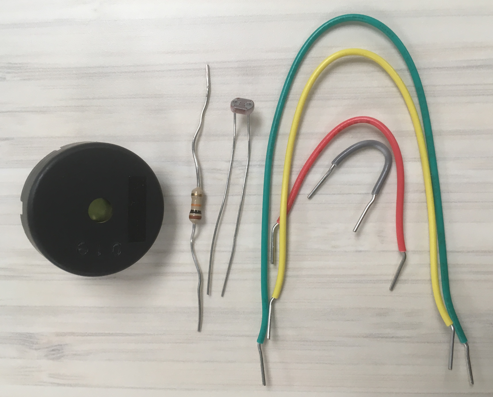
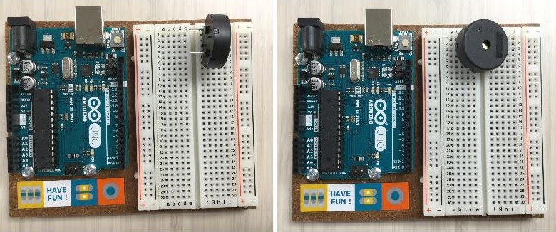
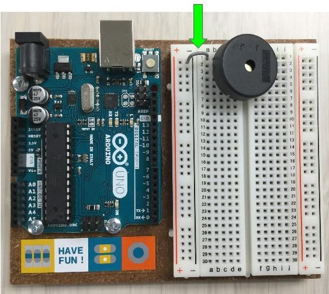
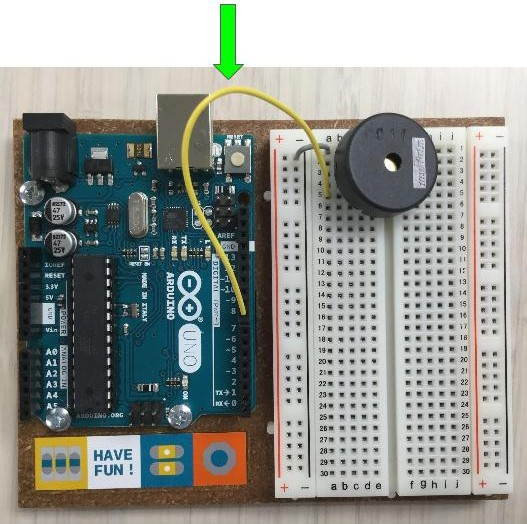
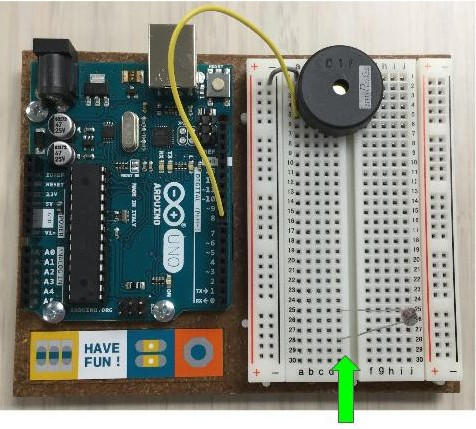
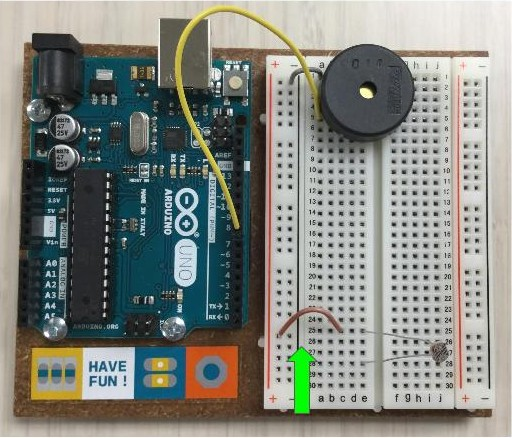
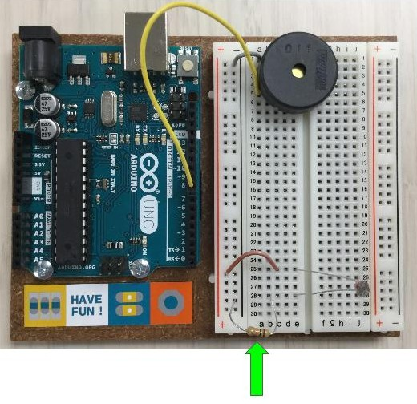
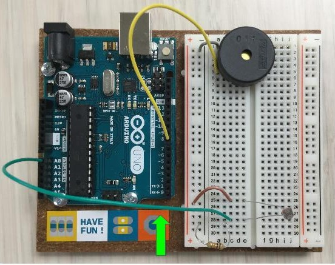
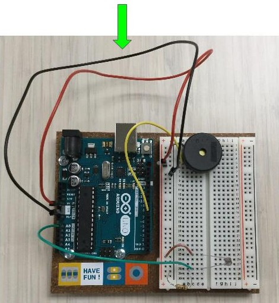

# 4.0 - Buzz

Time to make some buzz! Let's build a light theremin. 

For this project you will need some jumper wires, a piezo, a 10k ohm resistor, and a photoresistor. 

This time we are adding a *sensor*, the photoresistor, so that UNO can get input from the outside world, i.e. UNO can get interactive! 
The piezo provides the buzzing and we control it by having UNO read the photoresistor.

# 4.1 - Light theremin circuit 

## Connect piezo 

1. Gently insert the pins of your Piezo into row one and five.

    

2. Connect row one to the ground `-` rail with a wire jumper (i.e. piezo to GND)

    

3. Connect row five to pin `8` on the UNO using a wire jumper (i.e piezo to digital pin)

    

## Connect photoresistor

4. Insert the pins from the photoresistor in rows twentyfive and twentyeight.

    

5. Connect row twentyfive to the power `+` rail with a jumper wire. 
(i.e. photoresistor to 5V)

    

6. Use 10k resistor to connect row twentyeight to ground `-` rail. 
(i.e. photoresistor to GND)

    

7. Connect row twentyeight to Pin `A0` on the UNO. 
(i.e. photoresistor to analog input)

    

## Connect power 

9. Connect the ground `-` rail to a `GND` pin on the UNO with a power jumper wire.

10. Connect the power `+` rail to the `5V` Pin on the UNO with a power jumper wire.

    

All ready to program... 

# 4.2 - Theremin code 

1. On the IDE, choose `File` > `Examples` > `StarterKit_BasicKit` > `p06_LightTheremin`

2. Plug UNO into the usb, and click the upload arrow to load the sketch. The first few seconds the program calibrates the photoresistor, so move your finger over and back to change the amount of light falling on the sensor. The buzzing will start soon - Enjoy!

3. Make the buzz less annoying! 
- Find at the line that says `int pitch = map(sensorValue, sensorLow, sensorHigh, 50, 4000);`
- `50, 4000` sets the range of tones we are mapping our sensor reading to. The lowest reading will translate to a tone of 50, the highest to 4000. Swap them so that it says `4000, 0`. What does this do? 

4. Edit and experiment! Try changing a few values in the `loop()`, such as:
- range of pitch: change `4000, 0` to something else
- tone length: change the third number in the `tone()` function
- loop delay: change the final `delay()` time 

5. Load other examples that work with this circuit:
- `File` > `Examples` > `Digital` > `toneMelody`
- Download [arduinoTeaching](https://github.com/evanwill/arduinoTeaching) examples. Look for `lightThereminBasic.ino`, a heavily annotated version of `p06_LightTheremin`.
